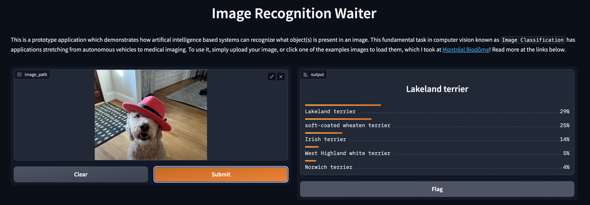

# Image Recognition MVP tool for testing AI Inference using Reesnet18 Waiter 2 tier app. 
Forked from this project: https://github.com/hasibzunair/imagercg-waiter

Currently: 
Updating images, converting to Podman and run on OpenShift and ROSA AWS OpenShift Managed Service 

This application *serves* a deep learning image classification model that recognizes what object is present in an image. It accepts images from the user, makes request to an API endpoint that makes a prediction, and shows results in a frontend UI. This workshop demonstrates use-cases of different tools such as `PyTorch`, `FastAPI`, `Gradio` and `Docker`.

Sample: 

    
  <em> 
  Model Input 
  </em>

Output Example

    
  <em> 
  </em>

### Usage Docker
To launch the application, run for docker: (pulls pre-built containers) 
>git clone https://github.com/emcon33/emcon33-waiter

Backend Only Direct Curl Upload 
>Direct Pre-Built Image docker.io/andrewwg/classification_model_serving
>cd<path>/backend
>docker build -t classification_model_serving .
>docker run -p 8000:80 classification_model_serving
>curl -X POST -F image=@test2.jpeg "http://0.0.0.0:8000/api/predict"
<text output>

Web Front End Build and Deploy (current error on vartiable error)
>Direct Pre-Built Image docker.io hasibzunair/frontend_serving
cd<path>/frontend
>docker build -t frontend_serving .
>docker run -p 7860:7860 --add-host host.docker.internal:host-gateway frontend_serving

Broken with this message 
(base) agrimes@andys-mbp frontend % docker run -p 7860:7860 --add-host host.docker.internal:host-gateway andrewwg/frontend_serving 
Traceback (most recent call last):
  File "/app/main.py", line 32, in <module>
    inputs = gr.inputs.Image(type='filepath')
AttributeError: module 'gradio' has no attribute 'inputs'

The app is live in `http://0.0.0.0:7860`. Upload images to make a prediction via Curl or Web Front End. 

### Usage Podman
Backend
>podman build -t classification_model_serving .
>podman run -p 8000:80 --name cls-serve classification_model_serving
>curl -X POST -F image=@test2.jpeg "http://0.0.0.0:8000/api/predict"

Frontend 
<see error above>

#### Todos
* Port to Podman
* Port to OpenShift/ROSA
* Rebuild as Workshop for AWS ROSA

### References
Original source https://towardsai.net/p/machine-learning/build-and-deploy-custom-docker-images-for-object-recognition
Forked from this github https://github.com/hasibzunair/imagercg-waiter
